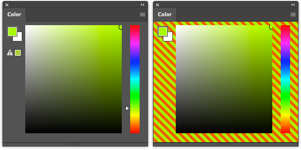

# Color2

Color2 is an improved hue-cube color selector that is designed to be more space-efficient than Photoshop's default, while also adding in a couple of small but useful features.

The two-color mixer beneath the hue-cube makes it easy to blend between two colors. Click on either end-box to save the current foreground color, and the gradient between the two boxes will update. Pick anywhere along the gradient to select a new foreground color.

Color2 also features a value palette, including a neutral gray, which is useful for laying down base values on an `overlay` layer.

Want more color selection tools? [Check out Color2's companion project, Kelvin.](https://github.com/gruntbatch/Kelvin)

[Contribute a coffee to the Color2 development fund.](https://ko-fi.com/L3L36L4P0)

## Installation

This has only been tested in Photoshop 2021. It _should_ work in Photoshop 2020, and it _might_ work in Photoshop 2019, but I don't support either of those.

Download the [lastest `Color2.zxp` file](https://github.com/gruntbatch/Color2/releases/tag/v1.0.0) from the releases page. It is signed with a self-signed certification, so it _should_ install without issue, but it might raise a warning. You can install the `.zxp` file manually, or using your preferred ZXP manager.

I recommend enabling Photoshop's debug mode, and then cloning this repository into your `Adobe/CEP/extensions` folder. See:

[Where to plonk my Adobe extensions?](https://creative-scripts.com/where-to-plonk-my-extensions/)

[Setting Cep Debug Mode and Log Level the Easy Way](https://creative-scripts.com/setting-cep-debug-and-log-level/)

## Inspiration

The color mixer was inspired by a similar feature found on [Len White's PantersWheel](https://nerdchallenge.com/lenwhite/LenWhite.com/LenWhite.com/Entries/2012/9/16_PW_CS6.html). I only made the selection a gradient rather than distinct samples of color.

Photoshop's default color picker leaves a lot of unused space (about 20%). I took inspiration from ZBrush's color picker, and crammed things in tighter, while still managing to have finer control over hue selection over Photoshop's default (about 400% more granularity, if you want to rub it in).

## License

All of my code is released under the GNU GPLv3 License. You're free to modify things as you'd like. However, `CSInterface.js` was made by Adobe, and is subject to some arcane, proprietary license.
